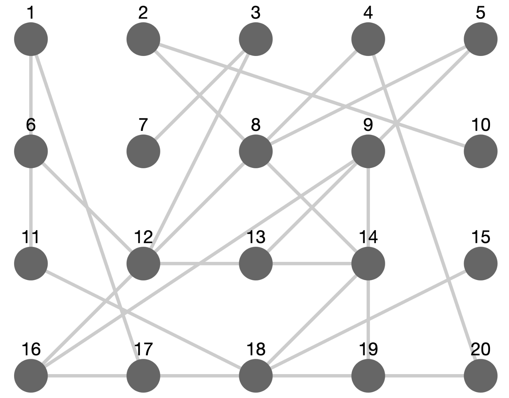

# Cytoscape Fcose Layout Plugin

This project provides a custom Cytoscape layout plugin, named **fcose**, that can be integrated to create advanced graph layouts for Cytoscape visualizations. Initially, the plugin demonstrates a grid-based layout as a starting point for further improvements.

## Why "fcose"?

The name `fcose` stands for **Fast Compound Spring Embedder**. It is inspired by traditional force-directed layouts like the Compound Spring Embedder (COSE) but is designed to be faster and more efficient—especially when handling compound graphs with nested structures. The emphasis on "fast" makes it suitable for larger, more complex datasets while still preserving the benefits of a compound layout.



## Features

- **Custom Layout Plugin:** Implements a Cytoscape layout called `fcose` that can be extended with advanced algorithms.
- **Webpack & Babel:** Built using modern JavaScript tooling.
- **Flask Integration:** Designed to work with a Flask backend serving the bundled assets.
- **Easy Integration:** Register the plugin easily with Cytoscape using `cytoscape.use()`.

## Prerequisites

- **Node.js** (v22.x or later recommended)
- **npm** (v11.x or later)
- **Python** (if using the provided Flask backend)

## Installation

1. **Clone the Repository:**
   ```bash
   git clone https://github.com/jmg421/cytoscape-fcose.git
   cd cytoscape-fcose
   ```

2. **Install npm Dependencies:**
   ```bash
   npm install
   ```

3. **Build the Plugin Bundle:**
   ```bash
   npx webpack --config webpack.config.js
   ```
   The bundle will be output to `/static/js/cytoscape-fcose.bundle.js`.

## Usage

Include Cytoscape and the plugin bundle in your HTML:
```html
<!DOCTYPE html>
<html lang="en">
   <head>
      <meta charset="UTF-8">
      <title>Graph Visualization</title>
         <script src="https://unpkg.com/cytoscape/dist/cytoscape.min.js"></script>
         <script src="/static/js/cytoscape-fcose.bundle.js"></script>
         <script>
            if (typeof cytoscapeFcose !== 'undefined') {
               cytoscape.use(cytoscapeFcose);
            } else {
               console.error("cytoscapeFcose is not defined. Ensure the bundle is loaded correctly.");
            }
         </script>
   </head>
   <body>
      <div id="cy" style="width: 800px; height: 600px; border: 1px solid #ccc;"></div>
      <script src="/static/js/graph.js"></script>
   </body>
</html>
```


Initialize Cytoscape with the fcose layout in your JavaScript (e.g., `graph.js`):
```javascript
document.addEventListener('DOMContentLoaded', function () {
   fetch('/graph_data')
      .then(response => response.json())
      .then(data => {
        const cy = cytoscape({
            container: document.getElementById('cy'),
            elements: data,
            style: [
                {
                    selector: 'node',
                    style: {
                        'background-color': '#666',
                        'label': 'data(id)'
                    }
                },
                {
                    selector: 'edge',
                    style: {
                            'width': 3,
                            'line-color': '#ccc'
                    }
                }
            ],
            layout: {
                name: 'fcose',
                animate: true
            }
        }
       });

    // Attach the Cytoscape instance to the global window for debugging
    window.cy = cy;
    console.log("Cytoscape instance initialized:", cy);
})
.catch(error => {
    console.error('Error fetching or initializing graph data:', error);
});
```


## Development

- **Source Code:** Modify `src/index.js` to update the plugin’s layout algorithm.
- **Bundling:** Webpack configuration is in `webpack.config.js` and Babel settings in `.babelrc`.
- **Testing:** Use the browser console (e.g., `cy.nodes().map(n => n.position())`) to verify node positions.

## License

This project is licensed under the [MIT License](LICENSE).